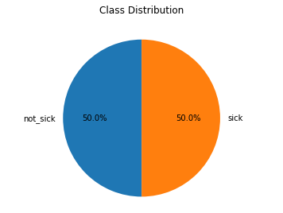
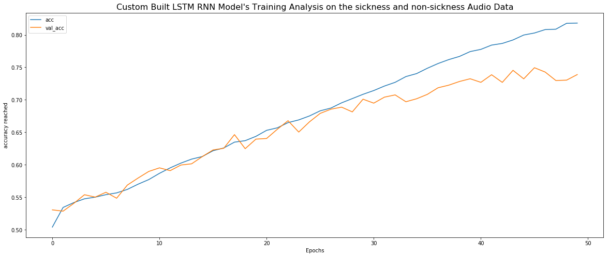

# CoughVid- Covid19 Detection from Cough Voice Samples

## Project Objective:
1. Project is created with intection to detect/classify an audio signal if it is such as a cough or sneeze audio signal.
2. Further goal is to pipeline this to mobile applications to narrow the detection of sickness audio specificlly of a COVID19. 
3. To contribute to help gov authorities to identify the persons with probable coronavirus infection living among us.
("We should fight the Virus, not the Patient effected with virus")

## Challenge
- Develop machine learning models for **detection of sickness sounds (coughing and sneezing) for Covid-19**

## Data Description
- **Dataset Source:** [Link](https://osf.io/tmkud/)

**Motivation:**

This dataset has been created for the [Pfizer Digital Medicine Challenge.](https://www.cmg.org/hack-pfizer/)

1. Early detection of respiratory tract infections can lead to timely diagnosis and treatment, which can result in better outcomes and reduce the likelihood of severe complications. 

2. Respiratory sounds carry rich information that can be mined to develop automated approaches for detection of sickness behaviors like coughing and sneezing. 

3. In this challenge, we invite you to build machine learning models for automatic detection of sickness sounds by using audio recordings from open datasets. 

4. The dataset was created using audio files from [ESC-50](https://github.com/karoldvl/ESC-50) and [AudioSet](https://research.google.com/audioset/).

5. We used the open source [BMAT Annotation Tool](https://github.com/BlaiMelendezCatalan/BAT) to annotate this dataset.

## Dataset
The dataset is organized as follows:

train
- sick (n=1435)
- not_sick (n=2283)

validation
- sick (n=468)
- not_sick (n=753)

test
- sick (n=642)
- not_sick (n=1012)

#### [COVID 19 Cough Audio- 49 year old Male in UK](https://www.youtube.com/watch?v=8VA73zW2DXY) 

**Patient Details:**
- Age: 49
- Sex: Male
- Country: UK
- Day: 5
- Resource Date: Mar 23, 2020
- Infection Symptoms: cannot Breathe, Heavy Coughs.
- Health Status before effected by COVID'19: Healthy Person, Regular Swimmer

# Preprocessing
**Data is Cleaned and Following is the class distribution:**

 
> The above analysis explains that the dataset of both classes in the training folder is equally distributed in the length.

**The MFCC Feature Extraction is applied to every training sample to get 13x99 features/coefficients. This is the method used to convert the audio data into numpy arrays**

## Model Building

## Training Analysis and Conclusion

- It is understood that the MFCC and Spectrograms of the audio signals can also be used as image dataset and build CNN Models to classify the audio samples.

